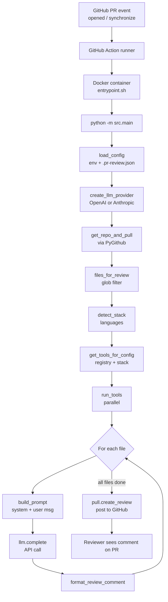
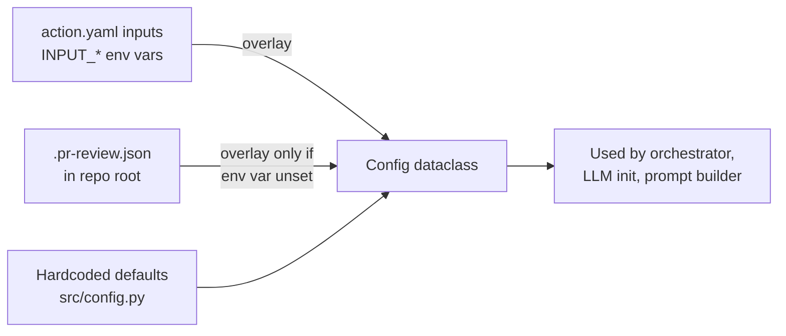
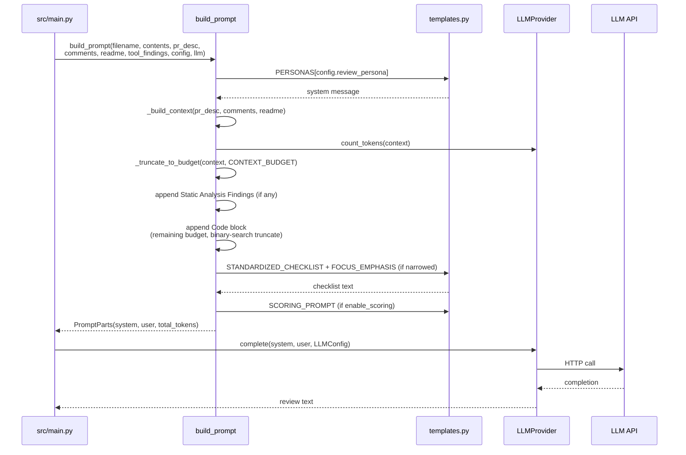

# IMPLEMENTATION.md — PR Review Assistant

This document explains how the PR Review Assistant is put together: what happens end-to-end when a pull request triggers a review, how each subsystem is organized, and where to make changes when extending the tool.

It is written for contributors. End-user docs live in [README.md](README.md).

---

## 1. Overview

The PR Review Assistant is a GitHub Action that posts LLM-authored code reviews on pull requests. It runs as a Docker container, fetches PR metadata and changed files via the GitHub API, optionally runs local static analysis tools against the workspace, and sends a carefully budgeted prompt — system message (persona) + user message (file + context + tool findings + standardized checklist) — to an LLM provider (OpenAI or Anthropic). The LLM response is formatted into a GitHub review comment.

All reviews share a **standardized 8-category defect checklist** regardless of persona, so the coverage is consistent and results are directly comparable across teams and modes.

---

## 2. High-Level Flow



**Entry point:** [action.yaml](action.yaml) → [entrypoint.sh](entrypoint.sh) → [src/main.py](src/main.py).

---

## 3. Component Map

| Directory / File | Purpose | Key Entry Points |
|---|---|---|
| [action.yaml](action.yaml) | GitHub Action manifest: inputs, Docker runtime, env var wiring | — |
| [Dockerfile](Dockerfile) | Container definition (Python 3.11-slim + tier-1 tools) | — |
| [entrypoint.sh](entrypoint.sh) | Shell entry; dispatches to `python -m src.main` | — |
| [src/main.py](src/main.py) | Orchestrator — wires every subsystem | `main()` |
| [src/config.py](src/config.py) | Config dataclass + env/JSON loader | `Config`, `load_config()`, `_merge_repo_config()` |
| [src/github_client.py](src/github_client.py) | PyGithub wrapper: fetch PR, files, comments, README | `get_repo_and_pull()`, `files_for_review()` |
| [src/llm/base.py](src/llm/base.py) | Abstract `LLMProvider` + `LLMConfig` | `LLMProvider.complete()`, `count_tokens()`, `max_context_tokens()` |
| [src/llm/openai_provider.py](src/llm/openai_provider.py) | OpenAI / OpenAI-compatible implementation (tiktoken) | `OpenAIProvider` |
| [src/llm/anthropic_provider.py](src/llm/anthropic_provider.py) | Anthropic Claude implementation | `AnthropicProvider` |
| [src/prompt/templates.py](src/prompt/templates.py) | `PERSONAS`, `STANDARDIZED_CHECKLIST`, `FOCUS_EMPHASIS`, `SCORING_PROMPT`, `LANGUAGE_MAP` | `detect_language()` |
| [src/prompt/builder.py](src/prompt/builder.py) | Prompt assembly + token-aware truncation | `build_prompt()`, `build_system_message()`, `build_user_message()`, `_truncate_to_budget()` |
| [src/tools/base.py](src/tools/base.py) | `BaseTool` interface + `Finding` dataclass + finding formatter | `BaseTool`, `Finding`, `ToolResult`, `format_findings_for_prompt()` |
| [src/tools/registry.py](src/tools/registry.py) | Auto-discovers analyzers under `analyzers/` | `get_tools_for_config()` |
| [src/tools/runner.py](src/tools/runner.py) | Parallel execution of selected tools | `run_tools()` |
| [src/tools/stack_detector.py](src/tools/stack_detector.py) | Language/tech-stack detection from files | `detect_stack()` |
| [src/tools/analyzers/](src/tools/analyzers/) | Drop-in tool plugins (Semgrep, Ruff, Bandit, ESLint, …) | Each subclasses `BaseTool` |
| [src/checks/](src/checks/) | PR-metadata quality checks (description, test coverage, git hygiene) | `pr_quality.py`, `test_coverage.py`, `git_hygiene.py` |
| [src/review/formatter.py](src/review/formatter.py) | Assembles final GitHub review comment (header + persona body + tools summary) | `format_review_comment()` |
| [src/review/scoring.py](src/review/scoring.py) | Regex extraction of scores from LLM output | `extract_scores()` |

---

## 4. Configuration Precedence

Configuration is resolved in the following order (highest priority first):



**Implementation:** [src/config.py:107-137](src/config.py#L107-L137) — `_merge_repo_config()`. For each review field, the file config is only applied when the corresponding `INPUT_*` env var is empty, ensuring CI inputs win.

---

## 5. Prompt Assembly Pipeline

Every review produces two messages: a **system message** (persona-specific) and a **user message** (file + context + findings + standardized checklist).



### Token Budgets

Defined at the top of [src/prompt/builder.py:17-21](src/prompt/builder.py#L17-L21):

| Budget | Default (tokens) | Purpose |
|---|---|---|
| `SYSTEM_MSG_BUDGET` | 500 | Reserved for persona system message |
| `CONTEXT_BUDGET` | 2000 | PR description + recent comments + README excerpt |
| `TOOL_FINDINGS_BUDGET` | 1500 | Static analysis findings |
| `MIN_CODE_BUDGET` | 1000 | Minimum reserved for the file under review |

Remaining tokens (`max_context - output_budget - system - used`) are spent on the code block. `_truncate_to_budget()` ([src/prompt/builder.py:155-177](src/prompt/builder.py#L155-L177)) uses binary search over line counts to fit each section; truncated sections get a `*[N lines truncated to fit token budget]*` marker so the LLM is aware.

---

## 6. Personas and the Standardized Checklist

Personas are **only about tone**. The review checklist is the same regardless of which persona is selected.

**Personas** ([src/prompt/templates.py](src/prompt/templates.py) → `PERSONAS`):

- `normal` *(default)* — balanced, professional; category + severity per issue.
- `mentor` — educational, explains WHY, encouraging; for capstone/student use.
- `security-auditor` — emphasizes injection/auth/crypto/input validation; CWE labels.

Fallback: if an unknown persona is requested, [src/prompt/builder.py:33](src/prompt/builder.py#L33) falls back to `normal`.

**Standardized 8-category checklist** ([src/prompt/templates.py](src/prompt/templates.py) → `STANDARDIZED_CHECKLIST`) is appended to every user message in `_build_instructions()` ([src/prompt/builder.py:135](src/prompt/builder.py#L135)):

1. **Documentation Defects** — Naming; Comment
2. **Visual Representation Defects** — Bracket Usage; Indentation; Long Line
3. **Structure Defects** — Dead Code; Duplication (+ SOLID/DRY)
4. **New Functionality** — Use Standard Method (+ education/stdlib/testing)
5. **Resource Defects** — Variable Initialization; Memory Management (+ caching, cleanup)
6. **Check Defects** — Check User Input (+ auth, injection, secrets, crypto)
7. **Interface Defects** — Parameter (calls to functions/libraries)
8. **Logic Defects** — Compute (logic + error handling); Performance

**Focus emphasis** (`FOCUS_EMPHASIS`): when `review_focus` is narrowed (e.g. `security`), a short emphasis line is appended to tell the LLM which categories to weight more heavily. When `review_focus: all` (the default), no emphasis is added and all 8 categories carry equal weight.

---

## 7. Static Analysis Framework

```mermaid
flowchart TD
    A[Files changed in PR] --> B[stack_detector.detect_stack]
    B --> C[registry.get_tools_for_config]
    C --> D{tools input}
    D -->|auto| E[Select by detected stack]
    D -->|none| F[Skip tools, LLM-only]
    D -->|csv list| G[Select named tools]

    E --> H[For each tool]
    G --> H

    H --> I{is_available?}
    I -->|no, tier-2| J[install - apt/pip/npm]
    I -->|yes| K[run files in workspace]
    J --> K

    K --> L[ToolResult<br/>Findings[]]
    L --> M[runner aggregates]
    M --> N[format_findings_for_prompt]
    N --> O[Injected into user message]
```

- **`BaseTool` interface** ([src/tools/base.py](src/tools/base.py)): `name`, `languages`, `category`, `is_available()`, `install()`, `run()` → `ToolResult(findings: list[Finding])`.
- **Plugin discovery**: [src/tools/registry.py](src/tools/registry.py) imports every module under `src/tools/analyzers/` at runtime; any `BaseTool` subclass is auto-registered. No manual wiring is required when adding a new tool.
- **Execution**: [src/tools/runner.py](src/tools/runner.py) runs selected tools in parallel and filters findings by `severity_threshold`.
- **Tiers**: Tier 1 (Semgrep, Ruff, detect-secrets) is pre-installed in the Docker image; Tier 2 (ESLint, PMD, Checkstyle, golangci-lint, Hadolint, ShellCheck, Trivy, Checkov, Bandit) is installed on-demand via the tool's `install()` method.

Finding format sent to the LLM ([src/tools/base.py:99-140](src/tools/base.py#L99-L140)):

```
### Findings for `path/to/file.py`
- **[HIGH]** (semgrep:python.lang.security.audit.exec-detected) Line 42: use of exec() is dangerous
  - *Suggestion:* replace with ast.literal_eval
**Summary:** 2 security, 3 quality issues found
```

---

## 8. LLM Provider Abstraction

All providers implement the abstract `LLMProvider` in [src/llm/base.py](src/llm/base.py):

```python
class LLMProvider(ABC):
    def complete(self, system_message: str, user_message: str, config: LLMConfig) -> str: ...
    def count_tokens(self, text: str) -> int: ...
    def max_context_tokens(self, model: str) -> int: ...
```

| Provider | Tokenizer | Context Window | Notes |
|---|---|---|---|
| `OpenAIProvider` | `tiktoken` (cl100k_base) | 128k–1M depending on model | Supports `api_base_url` override for Ollama, vLLM, Azure |
| `AnthropicProvider` | `len(text) // 4` approximation | 200k | Uses the `anthropic` SDK |

`count_tokens()` and `max_context_tokens()` drive the budget math in `build_user_message()` — the available envelope is `max_context - output_budget - SYSTEM_MSG_BUDGET`, and sections are allocated from that envelope in order.

---

## 9. Output Formatting and Scoring

- **`format_review_comment()`** ([src/review/formatter.py](src/review/formatter.py)) wraps the LLM response with a header (persona, model, tools run) and an optional findings summary before posting it to GitHub via `pull.create_review(..., event="COMMENT")`.
- **`extract_scores()`** ([src/review/scoring.py](src/review/scoring.py)) runs when `enable_scoring: true`. It uses a set of regex patterns to pull out `Code Quality`, `Security`, `Testing`, `Documentation`, `Architecture` scores (0–5 each) plus a 0–25 total from the LLM's free-form markdown response. When `SCORING_PROMPT` isn't in the prompt, extraction is skipped.

---

## 10. Extension Points

### Add a new persona

1. Add an entry to `PERSONAS` in [src/prompt/templates.py](src/prompt/templates.py) with the system-message text.
2. Add the persona name to the `review_persona` description in [action.yaml](action.yaml).
3. Document it in [README.md](README.md) under *Review Personas*.

The persona only changes tone — the standardized checklist is applied automatically.

### Add a new static analysis tool

1. Create `src/tools/analyzers/my_tool.py` that subclasses `BaseTool`.
2. Implement `is_available()`, `install()`, `run(files, workspace, config) -> ToolResult`.
3. Set `name`, `languages`, `category` class attributes.

No other changes needed — the registry auto-discovers it.

### Add a new LLM provider

1. Create `src/llm/my_provider.py` that subclasses `LLMProvider` and implements the three abstract methods.
2. Register it in `create_llm_provider()` in [src/main.py](src/main.py).
3. Add the provider name to the `llm_provider` description in [action.yaml](action.yaml).

### Tune token budgets

Edit the four constants at the top of [src/prompt/builder.py:17-21](src/prompt/builder.py#L17-L21). `MIN_CODE_BUDGET` is the floor for the code section — keep it well below the smallest model's context window minus the other budgets to avoid squeezing code out entirely.
